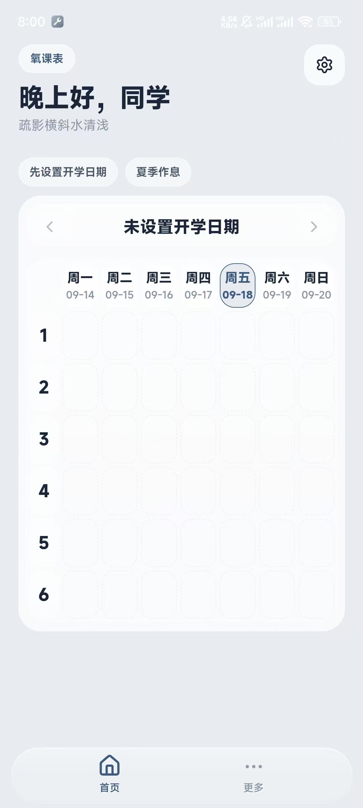
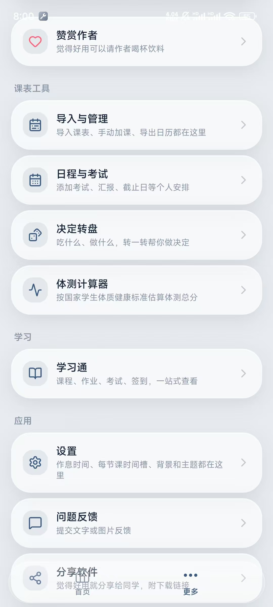
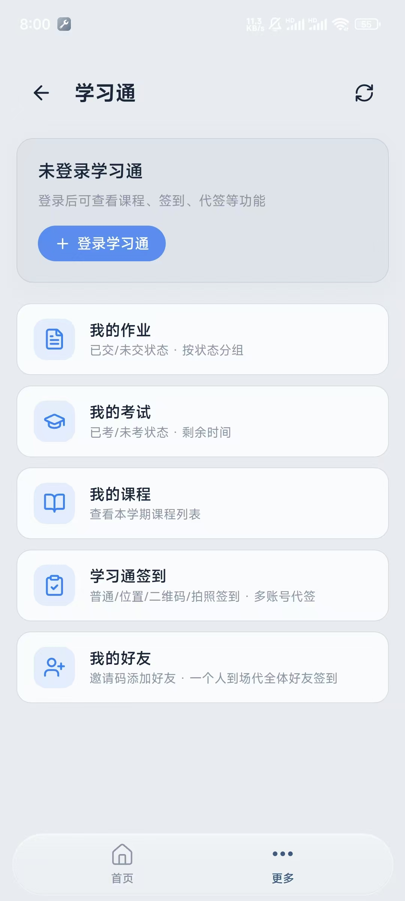

# 氧课表（Oxgeny）

氧课表是全高校通用、仅安卓可用的轻量化课表软件，设计简约美观，无开屏广告，占用内存小、运行流畅。

- **官网 / 下载**：http://112.125.16.84:8080/portal/home
- **最新 APK（v1.0.17）**：[GitHub Release 下载](https://github.com/xu20060420fan-cell/Oxgeny-timetable/releases/download/v1.0.17/oxygen-schedule-release.apk)

## 界面预览

## 核心功能

1. **截图导入课表**：上传教务课表截图给豆包解析，复制结果即可一键导入课程，不用手动逐条录入。
2. **今日首页视图**：展示当日课程，上完课程自动置灰，无课时界面干净，支持手动添加自定义日程，可查看当前周次与作息。
3. **周课表**：7 天网格 + 大节时间槽，左右滑动切周，点空白格加课。
4. **节数与作息全可配**：大节数、每节起止时间均可在设置中自由调整，导入课表自动按课程最大节次补齐。
5. **课程颜色自动分配**：同名课程永远同色，导入与手动加课均统一处理。
6. **体测计算器**：按《国家学生体质健康标准》计算总分。
7. **自定义背景 / Dock 透明度 / 小组件透明度 / 冬夏作息自动切换**。
8. **应用内热更新**：检测到新版本自动下载并覆盖安装。
